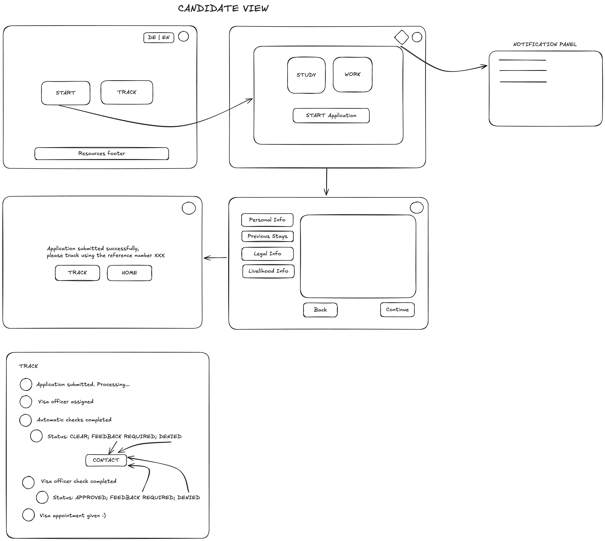
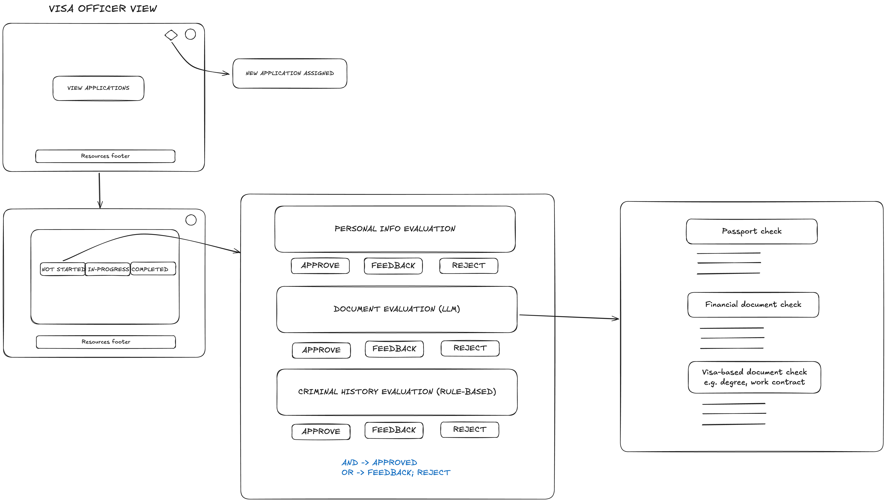

# Welcome to res[AI]de


## Overview

res-aide is a comprehensive visa application processing system that leverages AI and LLMs to streamline the application and review process. The system is divided into three main components:

1. **Candidate View**: This is for applicants who want to apply for a visa. Applicants can submit their information and related documents.
2. **Visa Officer View**: This handles all administrative tasks where visa officers review applications with the help of AI and provide comments accordingly.
3. **Document Processor**: This component processes documents using AI and LLMs, performing OCR analysis and text analysis on all submitted documents.

## Workflow
### Candidate View


### Visa Officer View



## Setup and Installation

### Prerequisites

- Python 3.12 or higher
- pip (Python package installer)
- Streamlit (for web application)

### Installation

1. **Clone the repository**:
    ```sh
    git clone https://github.com/toahaumar/resAIde.git
    cd resAIde
    ```

2. **Create a virtual environment**:
    ```sh
    python -m venv venv
    source venv/bin/activate  # On Windows use `venv\Scripts\activate`
    ```

3. **Install the required Python packages**:
    ```sh
    pip install -r requirements.txt
    ```

4. **Set up environment variables**:
    - Create a `.env` file in the  directory and add the necessary environment variables:
    ```env
    MISTRAL_API_KEY=your_mistral_api_key
    ```

5. **Run the application**:
    ```sh
    streamlit run candidate/main.py  # For candidate view
    streamlit run visa_officer/main.py  # For visa officer view
    ```

## Documentation

### APIs, Frameworks, and Tools Utilized

- **Streamlit**: Used for building the web application interface.
- **Mistral**: AI and LLM service used for OCR and text analysis.
- **Pillow**: Python Imaging Library used for image processing.
- **os, sys, json, base64**: Standard Python libraries for file and data handling.

### Technical Documentation

#### Candidate View

- **Homepage**: Displays a welcome message and allows users to navigate to the account or login/signup page.
- **Login/Signup**: Handles user authentication and account creation.
- **Application Process**: Guides the user through the visa application process, including personal information, previous stays, legal information, and livelihood information forms.
- **Success Page**: Displays a success message upon successful application submission.

#### Tracking Page

- **Overview**: Provides applicants with real-time updates on the status of their visa application.
- **Status Updates**: Displays various stages of the application process, such as submission, under review, additional information required, and final decision.
- **Transparency**: Ensures transparency by showing detailed logs of actions taken on the application, including timestamps and responsible officers.
- **Notifications**: Sends email and SMS notifications to applicants for important status changes and required actions.
- **Support**: Offers a contact form for applicants to reach out for support or additional information regarding their application status.

#### Visa Officer View

- **Application Review**: Allows visa officers to review submitted applications, perform document evaluations, and provide feedback.
- **Evaluation**: Uses AI to assist in the verification of documents and provides a final analysis of the application.
- **Resources**: Provides important contact information and troubleshooting guides for visa officers.

#### Document Processor

- **OCR and Text Analysis**: Uses Mistral's OCR and text analysis models to extract and analyze data from submitted documents.
- **Signature Comparison**: Compares extracted signatures with ground truth signatures to verify authenticity.
- **Classification**: Classifies applications based on the analysis results and provides recommendations for further action.

## Conclusion

This README provides a comprehensive overview of the res-aide project, including setup and installation instructions, documentation of APIs, frameworks, and tools utilized, and sufficient technical documentation to enable thorough jury evaluation. For more detailed information, please refer to the individual source files and their respective docstrings.